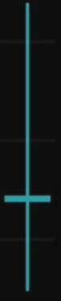
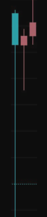

# Свечной Анализ

Свечной анализ - одна из основ трейдинга, без понимания которой не будет дальнейшего развития ваших навыков трейдинга. Является важным компонентом в понимании формирования цены.

> На цену влияют все, кто покупает или продает актив. Крупный игрок более значимо влияет на изменения курса, так как своим объёмом он может выкупить или продать монету, провоцируя тем самым изменения курса. Но крупному игроку не выгодно выкупать все заявки, поскольку он меньше заработает и с каждым ордером, ему будет менее выгодно покупать актив в данный момент.

---

## Важность таймфреймов

### При свечном анализе важно понимать то, что он может давать разные значения на различных ТФ!

При комплексном подходе к этому виду анализа следует разложить несколько ТФ, начиная с более старшего ТФ и заканчивая более локальным, в зависимости от вашей стратегии торговли. Все свечные модели важно анализировать после их закрытия, а не во время формирования, так как конечное время формирования может полностью отличаться от свечи, которая была в начале формирования своего ТФ.

Важно учитывать свечи на разных ТФ, в зависимости от вашей стратегии торговли. При анализе свеч, мы можем увидеть совершенно другие свечи на меньших ТФ.

---

## Типы свечей

- **Зеленая свеча** - цена открытия ниже, чем цена закрытия. Спрос превышает предложение и цена будет расти.

- **Красная свеча** - цена открытия выше, чем цена закрытия. В этот период времени продавцов актива больше, чем покупателей, и как следствие, цена начинает падать.

---

## Тени свечей

Тень возникает, когда идет быстрое изменение цены, а затем происходит возврат к исходным значениям. Если свечи без теней, то это говорит о силе одной из сторон и о большем объеме в данный момент. Тени возникают из-за дисбаланса объёмов в моменте.

### Свечи с тенью и без

Тень свечи является одним из подтверждения дальнейшей волатильности в противоположную сторону. Для лучшего определения тренда дальнейшего локального важно рассматривать динамику движения цены и совокупность свечных моделей. И это я еще не говорю про другие виды анализа, только свечной.

---

## Примеры свечных моделей

### 1. Вечерняя звезда

Говорит о том, что продавец агрессивно поглотил своим объемом покупки, а также о слабости покупателя.

### 2. Утренняя звезда (Молот)

Говорит об агрессивном поглощении продаж покупателем и, как следствие, не заинтересованность продавца в продаже актива по столь низкой цене.

