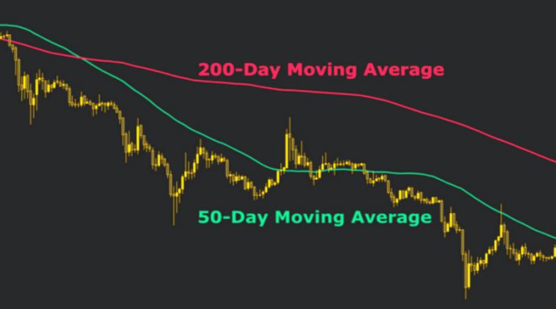
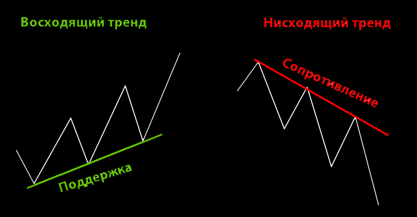

# Определение Тренда

Тренд - это направление преобладающего движения цены на рынке. Умение правильно определять текущий тренд является ключевым навыком для успешной торговли, так как правило "тренд - твой друг" остается актуальным во все времена.

---

## Типы трендов

### 1. Восходящий тренд (Бычий)

Характеризуется последовательным формированием более высоких максимумов (Higher Highs - HH) и более высоких минимумов (Higher Lows - HL). Спрос превышает предложение, покупатели доминируют на рынке.

**Признаки:**
- Каждый новый пик выше предыдущего
- Каждая коррекция останавливается выше предыдущей
- Цена находится выше ключевых уровней поддержки

### 2. Нисходящий тренд (Медвежий)

Характеризуется последовательным формированием более низких максимумов (Lower Highs - LH) и более низких минимумов (Lower Lows - LL). Предложение превышает спрос, продавцы контролируют рынок.

**Признаки:**
- Каждый новый максимум ниже предыдущего
- Каждый новый минимум ниже предыдущего
- Цена находится ниже ключевых уровней сопротивления

### 3. Боковой тренд (Флэт)

Цена движется в горизонтальном диапазоне между уровнями поддержки и сопротивления. Отсутствует явное преимущество покупателей или продавцов.

**Признаки:**
- Цена колеблется в определенном диапазоне
- Нет явных HH/HL или LH/LL
- Объемы торговли обычно снижены

---

## Методы определения тренда

### 1. Метод структуры рынка (Higher Highs / Lower Lows)

**Самый надежный метод** - анализ формирования экстремумов:

- **Восходящий тренд:** HH + HL (более высокие максимумы и минимумы)
- **Нисходящий тренд:** LH + LL (более низкие максимумы и минимумы)
- **Неопределенность:** Смешанная структура требует ожидания подтверждения

### 2. Скользящие средние (Moving Averages)

Используются для сглаживания ценовых колебаний и определения направления тренда.

**Популярные настройки:**
- **MA 50** и **MA 200** - для долгосрочного тренда
- **MA 20** и **MA 50** - для среднесрочного тренда
- **EMA 9** и **EMA 21** - для краткосрочного тренда

**Сигналы:**
- Цена выше MA → восходящий тренд
- Цена ниже MA → нисходящий тренд
- Пересечение быстрой MA выше медленной (Golden Cross) → бычий сигнал
- Пересечение быстрой MA ниже медленной (Death Cross) → медвежий сигнал

### 3. Трендовые линии

Проводятся через последовательные минимумы (в восходящем тренде) или максимумы (в нисходящем тренде).

**Правила построения:**
- Минимум 2 точки касания для построения
- 3 точки касания подтверждают силу линии
- Чем больше касаний, тем значимее линия
- Пробой трендовой линии может сигнализировать о развороте

### 4. Индикатор ADX (Average Directional Index)

Измеряет силу тренда независимо от его направления.

**Интерпретация:**
- **ADX < 20** - слабый тренд или флэт
- **ADX 20-25** - формирование тренда
- **ADX 25-50** - сильный тренд
- **ADX > 50** - очень сильный тренд

**Дополнительно:** Линии +DI и -DI показывают направление:
- +DI выше -DI → восходящий тренд
- -DI выше +DI → нисходящий тренд

---

## Мультитаймфреймовый анализ тренда

### Важность анализа на разных ТФ

Один из самых важных принципов определения тренда - анализ на нескольких таймфреймах одновременно. Тренд на одном ТФ может быть коррекцией на старшем.

**Рекомендуемый подход:**

1. **Старший ТФ** (1D, 1W) - определение глобального тренда
2. **Средний ТФ** (4H, 1H) - определение среднесрочного тренда и точек входа
3. **Младший ТФ** (15M, 5M) - точная отработка входа

**Правило:** Лучшие сделки открываются, когда тренд совпадает на всех анализируемых таймфреймах.

---

## Подтверждение тренда

### Объемы

Растущие объемы при движении цены по тренду подтверждают его силу:
- В восходящем тренде: рост на зеленых свечах, падение на красных
- В нисходящем тренде: рост на красных свечах, падение на зеленых

### Свечной анализ

Формирование характерных свечных паттернов в направлении тренда усиливает сигнал:
- **В восходящем тренде:** бычьи поглощения, молоты на уровнях поддержки
- **В нисходящем тренде:** медвежьи поглощения, падающие звезды на сопротивлениях

### Пробои уровней

- Восходящий тренд: пробои уровней сопротивления с ретестом
- Нисходящий тренд: пробои уровней поддержки с ретестом

---

## Признаки ослабления тренда

⚠️ **Важно уметь определять, когда тренд теряет силу:**

1. **Дивергенция** на осцилляторах (RSI, MACD)
2. **Уменьшение объемов** в направлении тренда
3. **Замедление движения** - формирование более коротких импульсов
4. **Нарушение структуры** - в восходящем тренде появился LL, в нисходящем - HH
5. **Увеличение коррекций** - откаты становятся глубже
6. **Консолидация** - цена начинает двигаться в узком диапазоне
